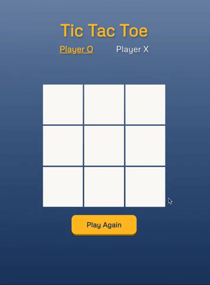

# Tic Tac Toe #

  

  

  <a href="https://scottwright-dev.github.io/odin-project-tic-tac-toe/">Click here for demo</a>

### Description
The objective of this project is to showcase the principles of modular and object-oriented programming using JavaScript. Using the classic Tic Tac Toe game format, the emphasis was to minimise the use of global code and organise the game functionality within object modules and factory functions.

The first iteration of the game was developed to be playable exclusively in the console, the purpose of this approach was to first validate the logic of the game without relying on a user interface. This logic was then incorporated into the final browser playable UI version.

### Technologies Used:
- JavaScript
- HTML
- CSS

### What I Learned

- JavaScript object modules
- Factory functions
- IIFE's
- Encapsulation
- Atomic git commits

### Thoughts and Observations

Through this project, I gained valuable insights into the benefits of using modular code and object-oriented programming in JavaScript. By adopting a modular approach, I was able to create more secure, reusable code that is easier to maintain and understand. During this development process, I adopted the <a href="https://suchdevblog.com/lessons/AtomicGitCommits.html">Atomic Git Commits</a> strategy to emphasise this approach further. Where I tried as much as possible to limit the scope of each commit to a single logical change.

### Additional Feature Ideas 
- Implement AI player.
- Enhance UI feedback so winning squares are highlighted on the board following winning moves. 
- Add the ability to customise player names via user input.
 
### Credits
- Button design: <a href="https://www.joshwcomeau.com/animation/3d-button/">Josh Comeau</a>

